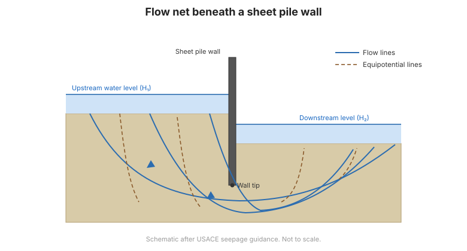

# Chương 6 — Thấm & Lưới thấm

## 6.1 Thấm và hệ quả

**Thấm** là dòng nước qua đất dưới gradient thủy lực. Nó quan trọng vì:

- tạo **lực thấm** lên khung hạt rắn, làm giảm ổn định;
- gây **áp lực đẩy nổi** lên công trình;
- có thể gây **xói ngầm (piping)** và **xói nội bộ**, cơ chế của nhiều sự cố đập và đê; và
- chi phối **cố kết** và tốc độ lún.

## 6.2 Lưới thấm

**Lưới thấm** là lời giải đồ thị của phương trình Laplace cho thấm ổn định. Nó gồm hai họ
đường trực giao:

- **Đường dòng** — đường nước đi theo; và
- **Đường đẳng thế** — đường có cùng cột nước tổng.

Lưới được vẽ sao cho các phần tử **"vuông"**. Từ đó kỹ sư đọc được:

- **lưu lượng thấm** $q = k H (N_f / N_d)$;
- **áp lực nước lỗ rỗng** (do đó đẩy nổi) tại mọi điểm;
- **gradient thoát** ở mặt hạ lưu, yếu tố quyết định xói ngầm.

**Hình.** Lưới thấm dưới tường cừ: đường dòng và đường đẳng thế cho lưu lượng thấm, đẩy nổi và gradient thoát (theo hướng dẫn thấm của USACE).

## 6.3 Đẩy nổi và lực đẩy

Áp lực nước tác dụng **hướng lên** lên công trình hoặc khối đất, làm giảm ứng suất hữu
hiệu. Dưới đập hoặc bản sàn, áp lực **đẩy nổi** được đọc từ lưới thấm và phải được kháng
bởi trọng lượng công trình. Nơi đẩy nổi làm ứng suất hữu hiệu bằng không, đất **nổi lên**
và mất toàn bộ cường độ.

## 6.4 Xói ngầm và xói nội bộ

**Xói ngầm** xảy ra khi **gradient thoát** ở mặt hạ lưu vượt giá trị tới hạn, khiến nước
nâng và cuốn hạt đất đi, tạo một "ống" tiến dần về thượng lưu và có thể gây sụp. **Hệ số an
toàn chống xói ngầm** so gradient tới hạn (thường ~1,0, hoặc thấp hơn cho an toàn) với
gradient thoát thực.

Giảm thiểu gồm:

- **kéo dài đường thấm** (tường cắt, thảm chống thấm);
- **tầng lọc và rãnh thoát** chặn và xả thấm an toàn; và
- **giếng giảm áp** để kiểm soát đẩy nổi.

## 6.5 Tầng lọc và thoát nước

**Tầng lọc** bảo vệ chống xói nội bộ bằng cách cho nước qua nhưng giữ hạt đất. Thiết kế
theo **tiêu chí lọc** (tầng lọc phải đủ thô để thấm và đủ mịn để giữ đất được bảo vệ).
**Lớp thoát nước** và **vải địa kỹ thuật** thực hiện cùng chức năng.

## 6.6 Các điểm then chốt cần ghi nhớ

- **Lực thấm** làm giảm ổn định và gây **đẩy nổi**.
- **Lưới thấm** cho lưu lượng thấm, áp lực nước lỗ rỗng và **gradient thoát**.
- **Xói ngầm** xảy ra khi gradient thoát quá cao — kiểm tra hệ số an toàn.
- **Tầng lọc và rãnh thoát** là biện pháp bảo vệ chuẩn chống xói nội bộ.
- Thấm chi phối **cố kết** và phải được quản lý trong thiết kế.
