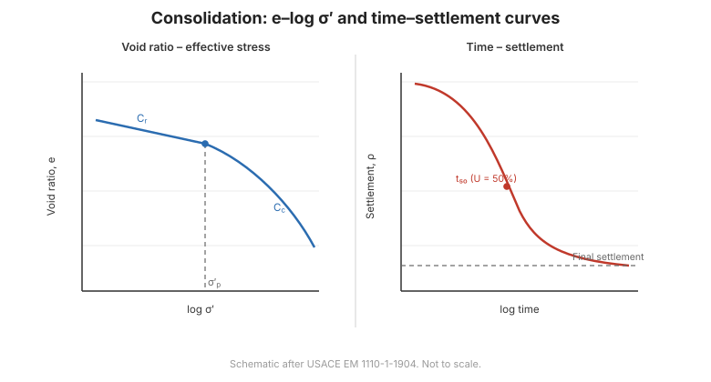

# Chương 9 — Cố kết

## 9.1 Cố kết là gì

**Cố kết** là biến đổi thể tích **theo thời gian** của đất hạt mịn bão hòa khi **áp lực
nước lỗ rỗng thặng dư tiêu tán** và tải chuyển từ nước sang khung hạt rắn. Đây là cơ chế
đằng sau lún dài hạn của sét, chi phối bởi **lý thuyết cố kết một chiều Terzaghi**.

## 9.2 Thí nghiệm nén cố kết (oedometer)

**Thí nghiệm cố kết một chiều (oedometer)** chất tải theo cấp lên mẫu bị hạn chế và ghi
nén theo thời gian. Từ đó thu được:

- **chỉ số nén** $C_c$ (độ dốc nhánh nén nguyên sơ);
- **chỉ số nén lại** $C_r$ (độ dốc dỡ–chất lại);
- **áp lực tiền cố kết** $\sigma'_p$ — ứng suất hữu hiệu lớn nhất trong quá khứ;
- **hệ số cố kết** $c_v$ — thông số tốc độ.

## 9.3 Độ lớn của lún

Với sét cố kết thường, lún cố kết sơ cấp là:

$$S_c = \frac{C_c H}{1+e_0}\log\frac{\sigma'_{v0}+\Delta\sigma}{\sigma'_{v0}}$$

Với sét quá cố kết, dùng **chỉ số nén lại** tới $\sigma'_p$, và $C_c$ vượt quá. **Tỷ số quá
cố kết** $OCR = \sigma'_p / \sigma'_{v0}$ cho biết sét là NC ($OCR=1$) hay OC ($OCR>1$).

**Hình.** Cố kết: đường cong e–log σ′ cho $C_c$, $C_r$ và áp lực tiền cố kết, cùng đường cong thời gian–lún để suy ra $c_v$ (theo USACE EM 1110-1-1904).

## 9.4 Tốc độ cố kết

**Tốc độ** do **hệ số cố kết** $c_v$ và **chiều dài đường thoát nước** chi phối. **Nhân tố
thời gian** $T_v = c_v t / H_{dr}^2$ liên hệ độ cố kết $U$ với thời gian. Vì $H_{dr}$ bình
phương, **gấp đôi đường thoát nước làm thời gian tăng gấp bốn** — lý do **giếng thoát đứng**
([Chương 14](chapter-14-testing-program.md)) tăng tốc cố kết mạnh mẽ.

## 9.5 Nén thứ cấp

Sau cố kết sơ cấp, **nén thứ cấp (từ biến)** tiếp diễn ở ứng suất hữu hiệu gần như không
đổi. Nó đáng kể ở **sét hữu cơ và sét yếu**, được mô tả bằng **chỉ số nén thứ cấp**
$C_\alpha$. Với một số đất, nó chi phối lún dài hạn.

## 9.6 Các điểm then chốt cần ghi nhớ

- **Cố kết** là lún theo thời gian do **tiêu tán áp lực nước lỗ rỗng**.
- **Oedometer** cho $C_c$, $C_r$, $\sigma'_p$ và $c_v$.
- Độ lớn lún theo công thức **logarit $C_c$ / $C_r$**.
- **Tốc độ** do $c_v$ và **đường thoát nước** chi phối ($T_v = c_v t / H_{dr}^2$).
- **Nén thứ cấp** có thể chi phối ở đất hữu cơ.
