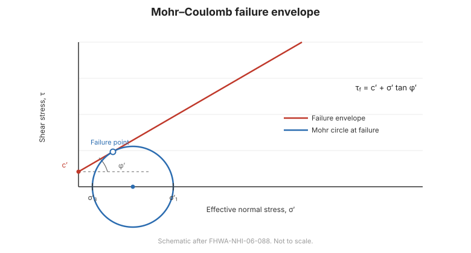

# Chương 10 — Sức kháng cắt

## 10.1 Tiêu chuẩn Mohr–Coulomb

**Sức kháng cắt** là khả năng chống trượt của đất — tính chất chi phối sức chịu tải, ổn định
mái dốc và áp lực đất. Tiêu chuẩn **Mohr–Coulomb** biểu diễn:

$$\tau_f = c' + \sigma'_n \tan\phi'$$

trong đó $c'$ là **lực dính hữu hiệu**, $\sigma'_n$ là **ứng suất pháp hữu hiệu**, và
$\phi'$ là **góc ma sát hữu hiệu**. Với điều kiện ứng suất tổng (không thoát nước), cùng
dạng dùng $c_u$ và $\phi_u = 0$:

$$\tau_f = c_u$$

**Hình.** Đường bao phá hoại Mohr–Coulomb: sức kháng cắt $\tau_f = c' + \sigma'\tan\phi'$, với vòng tròn phá hoại tiếp xúc đường bao (theo FHWA-NHI-06-088).

## 10.2 Sức kháng thoát nước và không thoát nước

Việc chọn thông số cường độ phụ thuộc **thoát nước**:

- **Thoát nước** — áp lực nước lỗ rỗng đã cân bằng; dùng thông số **hữu hiệu** $c', \phi'$.
  Tới hạn cho điều kiện **dài hạn** và cho cát.
- **Không thoát nước** — không thoát nước trong khi chất tải; dùng thông số **tổng**, thường
  là **$c_u$** với $\phi = 0$. Tới hạn cho điều kiện **ngắn hạn** ở sét bão hòa.

**Hệ số an toàn nhỏ hơn** từ cả hai chi phối thiết kế.

## 10.3 Thí nghiệm trong phòng

- **Cắt trực tiếp** — đơn giản, cho $c'$ và $\phi'$; kiểm soát được thoát nước.
- **Nén ba trục** — linh hoạt nhất: **UU** (không cố kết không thoát nước) cho $c_u$; **CU**
  (cố kết không thoát nước) có đo áp lực nước lỗ rỗng cho thông số hữu hiệu; **CD** (cố kết
  thoát nước) cho cường độ thoát nước.
- **Nén một trục (unconfined)** — cho $c_u$ nhanh với sét.
- **Cắt vòng (ring shear)** — cho cường độ dư trên mặt trượt sẵn có.

## 10.4 Các yếu tố ảnh hưởng sức kháng cắt

- **Mật độ và lịch sử ứng suất** — đất đặc hơn và quá cố kết thì mạnh hơn.
- **Xi măng hóa và cấu trúc** — liên kết tự nhiên thêm lực dính biểu kiến.
- **Dị hướng và khe nứt** — cường độ thay đổi theo hướng; khe nứt làm yếu khối đất.
- **Tốc độ chất tải** — cường độ không thoát nước phụ thuộc tốc độ.
- **Cường độ dư** — trên mặt trượt sẵn có, cường độ giảm tới giá trị **dư**, chi phối
  trượt tái hoạt.

## 10.5 Các điểm then chốt cần ghi nhớ

- **$\tau_f = c' + \sigma'\tan\phi'$** (hữu hiệu) hoặc **$\tau_f = c_u$** (không thoát nước).
- Chọn **thoát nước so với không thoát nước** theo điều kiện; $F$ nhỏ hơn chi phối.
- Thí nghiệm **ba trục** cho đủ dải: UU, CU, CD.
- Mật độ, lịch sử ứng suất, cấu trúc và tốc độ đều ảnh hưởng cường độ.
- Trên mặt trượt, dùng cường độ **dư**.
