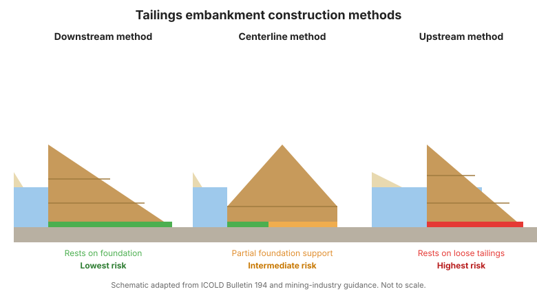
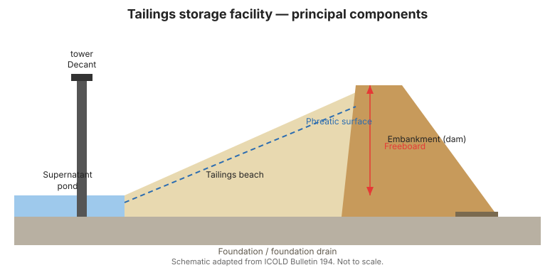

# Chương 2 — Cơ sở bùn thải và Cách chúng phá hoại

## 2.1 Các loại cơ sở bùn thải

Bùn thải được đổ thải dưới dạng bùn loãng và nước phân lớp bên trên được thu hồi
thông qua hệ thống **xả tràn (decant)**. Đập đắp giữ lớp bùn thải được đắp cao
theo một trong nhiều phương pháp, có ảnh hưởng mạnh đến an toàn:

- **Phương pháp hạ nguồn** — mỗi đợt đắp cao được đặt ở hạ nguồn của đợt trước,
  tạo ra mặt cắt rộng, ổn định với nền móng đỡ phần lớn công trình. Nói chung là
  bền vững nhất.
- **Phương pháp tim tuyến** — các đợt đắp cao được đặt trên tim tuyến; ở mức rủi
  ro trung gian.
- **Phương pháp thượng nguồn** — mỗi đợt đắp cao được đặt ở phía thượng nguồn
  (mặt đổ thải), dựa vào bãi bùn để chịu lực. **Rủi ro cao nhất**: đập đắp nằm
  trên vật liệu yếu nhất, thường rời rạc, bão hòa, và dễ bị hóa lỏng tĩnh và hóa
  lỏng do động đất.

Các cấu hình thay thế gồm lưu giữ **bãi / hố mỏ** và bùn thải **đặc / paste /
lọc**, làm giảm nước tự do và hạ rủi ro hóa lỏng.

## 2.2 Các mode phá hoại chủ đạo

Hiểu rõ cơ sở bùn thải phá hoại như thế nào giúp tập trung chương trình giám
sát. Các mode chính là:

1. **Hóa lỏng tĩnh của đập đắp hoặc lớp bùn.** Bùn thải rời rạc, bão hòa, có
   tính co ngắn mất cường độ dưới tải trọng tĩnh (ví dụ, một đợt đắp cao, sự
   tăng nhanh mặt nước thấm, hoặc yếu điểm nền móng) và chảy. Đây là cơ chế đứng
   sau một số vụ phá hoại lịch sử tồi tệ nhất.
2. **Hóa lỏng do động đất.** Rung lắc chu kỳ chuyển bùn thải bão hòa rời rạc
   thành trạng thái hóa lỏng, kích hoạt trượt chảy. Các vùng có động đất đòi hỏi
   chú ý đặc biệt đến các lớp có khả năng hóa lỏng.
3. **Tràn qua đỉnh.** Lưu lượng an toàn (freeboard) không đủ, mưa đặc biệt lớn,
   quản lý hồ sai, hoặc xả tràn bị tắc khiến nước tràn qua đỉnh đập đắp.
4. **Xói mòn trong (piping).** Thấm xói một kênh xuyên qua hoặc dưới đập đắp,
   thường không phát hiện được cho đến khi vỡ bục.
5. **Mất ổn định mái dốc (tĩnh).** Bãi bùn hoặc đập đắp quá dốc bị trượt, đặc
   biệt nơi áp lực nước lỗ rỗng cao.
6. **Phá hoại nền móng.** Nền móng yếu hoặc biến đổi (ví dụ, đất nén lún, karst,
   hoặc các lớp có thể hóa lỏng) dẫn đến lún, nứt, hoặc chảy.
7. **Phá hoại kết cấu của công trình phụ.** Tháp xả tràn, đường ống và máng xả
   tràn có thể hỏng và làm suy yếu toàn bộ hệ thống.

## 2.3 Chuỗi dẫn đến phá hoại

Hầu hết các vụ phá hoại thảm khốc không phải là sự kiện đơn lẻ mà là những
chuỗi: một điều kiện có sẵn (bùn thải rời rạc bão hòa, mặt nước thấm cao) cộng
với một tác nhân kích hoạt (mưa, đổ thải nhanh, động đất) cộng với việc phát hiện
không đầy đủ. Giám sát tồn tại để phá vỡ chuỗi đó — bằng cách bộc lộ điều kiện
có sẵn sớm.

!!! warning "Xây dựng thượng nguồn đòi hỏi sự cảnh giác đặc biệt"
    Các cơ sở dùng phương pháp thượng nguồn mang rủi ro tiềm ẩn cao nhất và là
    đối tượng của các nỗ lực toàn cầu nhằm cấm hoặc kiểm soát chặt chẽ chúng. Chương
    trình giám sát của chúng phải chuyên sâu nhất, với sự chú ý đặc biệt đến áp
    lực nước lỗ rỗng và hình học bãi bùn.

## 2.4 Liên kết các mode phá hoại với thiết bị quan trắc

| Mode phá hoại | Tín hiệu chính | Thiết bị quan trắc |
|--------------|---------------|-------------------|
| Hóa lỏng tĩnh / do động đất | Áp lực nước lỗ rỗng tăng, sức kháng SPT/CPT thấp, lún | Piezometer, inclinometer, khảo sát, CPT |
| Tràn qua đỉnh | Mất freeboard, mực hồ cao | Khảo sát, máy đo mức, lượng mưa |
| Xói mòn trong | Lực nâng, thấm đục, lún | Piezometer, tràn đo thấm, quan trắc trực quan |
| Mất ổn định mái dốc | Chuyển động, nứt | Khảo sát, inclinometer, extensometer |
| Phá hoại nền móng | Lún lệch, góc nghiêng | Khảo sát, piezometer, tiltmeter |

**Hình.** Các phương pháp đắp đập bùn thải. Phương pháp thượng nguồn nằm trên bùn thải lỏng, bão hòa và có rủi ro cao nhất (ICOLD Bulletin 194).

**Hình.** Các thành phần chính của cơ sở lưu giữ bùn thải: đập đắp, bãi bùn, hồ nước bề mặt, tháp xả tràn, mặt nước thấm và lưu lượng an toàn (ICOLD Bulletin 194).

## 2.5 Điểm mấu chốt

- Phương pháp xây dựng chi phối rủi ro tiềm ẩn; thượng nguồn là cao nhất.
- Hóa lỏng (tĩnh và do động đất) là cơ chế thảm khốc chủ đạo.
- Phá hoại là chuỗi của điều kiện có sẵn + tác nhân kích hoạt + phát hiện muộn.
- Ánh xạ mọi mode phá hoại vào thiết bị cụ thể trước khi thiết kế chương trình.
