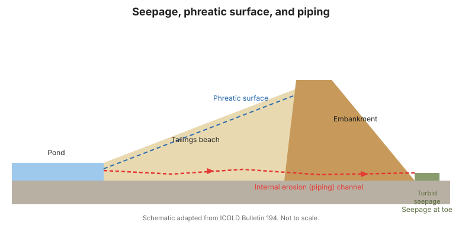

# Chương 7 — Giám sát thấm và mặt nước thấm

## 7.1 Thấm: bạn và thù

Một ít thấm là bình thường tại cơ sở bùn thải; **thấm không kiểm soát được hoặc
thay đổi** là chỉ thị hàng đầu của xói mòn trong (piping) và quá bão hòa. Nhiệm
vụ giám sát là định lượng thấm và phát hiện sự thay đổi.

## 7.2 Đo cái gì

- **Vị trí và độ trong** — thấm xuất hiện ở đâu và trong hay đục (độ đục có thể
  báo hiệu xói mòn trong).
- **Lưu lượng** — thể tích trên đơn vị thời gian, qua tràn hình chữ V, máng đo
  hoặc lưu kế.
- **Nhiệt độ và hóa học** — có thể phân biệt nguồn và phát hiện rò rỉ từ xả tràn
  hoặc đường ống.
- **Mặt nước thấm** — mực nước ngầm trong lớp bùn và đập đắp, theo dõi bằng
  piezometer ([Chương 6](chapter-06-pore-pressure.md)).

## 7.3 Hình học bãi bùn và mặt nước thấm

**Bãi bùn** là bề mặt dốc thoải nơi bùn loãng được đổ thải. Hình học của nó chi
phối vị trí mặt nước thấm. Một cơ sở vận hành tốt giữ mặt nước thấm **thấp và
trong bãi bùn**, xa đỉnh, bằng cách quản lý đổ thải và xả tràn. Giám sát bao gồm:

- **Độ dốc và chiều dài bãi bùn** (khảo sát, ảnh chụp quang từ drone).
- **Cao độ mặt nước thấm** từ piezometer và giếng quan trắc.
- **Freeboard** — khoảng cách thẳng đứng từ hồ đến đỉnh.

!!! danger "Quản lý bãi bùn chính là giám sát"
    Một bãi bùn ngắn hoặc thoải đẩy mặt nước thấm về phía đập đắp và giảm
    freeboard — một đường dẫn trực tiếp đến hóa lỏng và tràn qua đỉnh. Hình học
    bãi bùn không chỉ là vận hành; nó là một tham số an toàn.

## 7.4 Phát hiện xói mòn trong (piping)

Xói mòn trong thâm độc vì nó có thể hình thành bên trong đập đắp. Các dấu hiệu
cảnh báo:

- Thấm mới hoặc tăng, đặc biệt xả **đục** hoặc **cát**.
- Thấm xuất hiện ở các vị trí bất ngờ (chân đập, mái hạ nguồn).
- Lún hoặc hố lõm nhỏ trên một đường thấm.
- **Tăng đột ngột lưu lượng** mà không có mực hồ tương ứng tăng.

## 7.5 Thiết bị và phương pháp

- **Tràn đo và máng đo** cho tổng lưu lượng thấm.
- **Piezometer và giếng quan trắc** cho mặt nước thấm.
- **Giám sát trực quan** cho vị trí, độ trong và độ đục ([Chương 3](chapter-03-philosophy.md)).
- **Giám sát xả tràn** để xác nhận mực hồ và freeboard.

**Hình.** Thấm, mặt nước thấm và piping (xói mòn trong). Thấm đục tại chân hạ lưu là dấu hiệu cảnh báo (ICOLD Bulletin 194).

## 7.6 Điểm mấu chốt

- Định lượng thấm và theo dõi sự thay đổi, đặc biệt độ đục.
- Giữ mặt nước thấm thấp và trong bãi bùn; bảo vệ freeboard.
- Hình học bãi bùn là một tham số an toàn, không chỉ vận hành.
- Xói mòn trong báo hiệu qua thấm mới, đục hoặc tăng.
