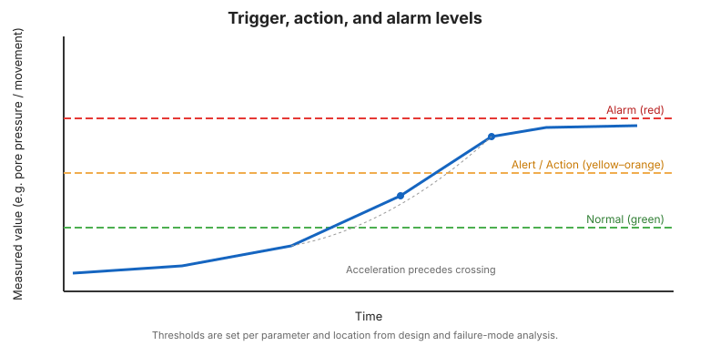

# Chương 13 — Đánh giá hiệu năng và Ra quyết định

## 13.1 Từ bất thường đến hành động

Giám sát tồn tại để hỗ trợ quyết định. Một chương trình vận hành tốt xác định, *từ
trước*, mỗi mức của mỗi tham số nghĩa là gì và chuyện gì phải xảy ra tiếp theo. Điều
này loại bỏ sự do dự trong một sự kiện.

## 13.2 Mức kích hoạt, hành động và báo động

Hầu hết kế hoạch định nghĩa các mức phân tầng:

- **Bình thường / xanh** — trong dải kỳ vọng; giám sát thường lệ.
- **Cảnh báo / vàng** — độ lệch đáng tăng tần suất và rà soát.
- **Hành động / cam** — phản ứng định trước: thông báo kỹ sư, hạn chế tiếp cận,
  tăng giám sát, chuẩn bị ứng phó.
- **Báo động / đỏ** — ứng phó khẩn cấp định trước: sơ tán hạ du, thông báo nhà
  quản lý, kích hoạt kế hoạch khẩn cấp.

Các mức được đặt cho mỗi tham số và mỗi vị trí, dựa trên thiết kế và phân tích mode
phá hoại ([Chương 2](chapter-02-facilities-and-failures.md)).

## 13.3 Hỗ trợ quyết định, không thay thế

Thiết bị và bảng điều khiển **hỗ trợ** phán đoán của kỹ sư chịu trách nhiệm; chúng
không thay thế. Một số đọc màu xanh không miễn trừ một vết nứt hữu hình; một màu
vàng đơn không bắt buộc sơ tán. Kế hoạch ghi chép ai quyết định và như thế nào.

## 13.4 Ứng phó khẩn cấp

Khi các mức đỏ hoặc suy yếu hữu hình xảy ra, phản ứng là vận hành, không chỉ kỹ
thuật:

- **Sơ tán** dân cư hạ du và nhân sự tại hiện trường theo kế hoạch khẩn cấp.
- **Thông báo** nhà quản lý và các bên liên quan.
- **Cô lập** nơi an toàn có thể (hạ mực hồ, chuyển hướng dòng chảy).
- **Ghi chép** các hành động và quan sát để rà soát sau.

## 13.5 Rà soát độc lập

Các cơ sở hậu quả cao hơn có lợi từ **rà soát định kỳ độc lập** dữ liệu giám sát
và chính chương trình — một cặp mắt mới về các xu hướng mà đội vận hành có thể đã
coi là bình thường.

!!! danger "Hành động khi có gia tốc"
    Lịch sử cho thấy các phá hoại bùn thải thảm khốc thường được đi trước bởi chuyển
    động tăng tốc hoặc tăng áp lực nước lỗ rỗng đã được quan sát nhưng không được
    hành động. Các mức hành động định trước tồn tại chính xác để buộc một phản ứng
    trước khi một ngưỡng bị vượt qua.

**Hình.** Mức kích hoạt, hành động và báo động. Tín hiệu giám sát vượt ngưỡng; gia tốc thường đi trước sự vượt ngưỡng (ICOLD Bulletin 194).

## 13.6 Điểm mấu chốt

- Định nghĩa mức kích hoạt/hành động/báo động từ trước, cho mỗi tham số và vị trí.
- Giám sát hỗ trợ — không bao giờ thay thế — phán đoán kỹ thuật chịu trách nhiệm.
- Định nghĩa trước ứng phó khẩn cấp: sơ tán, thông báo, cô lập, ghi chép.
- Rà soát độc lập bắt các xu hướng đã được coi là bình thường.
