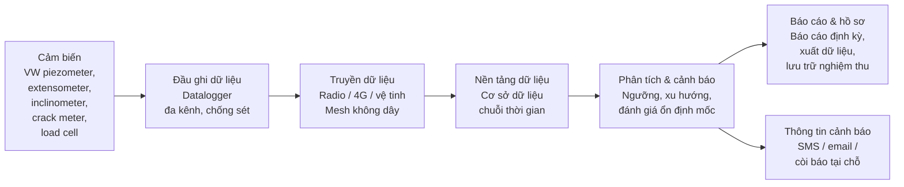

# Ma trận tuân thủ — Nghị định 114/2018/NĐ-CP & TCVN 9398:2012

!!! abstract "Tài liệu này là gì?"
    Đây là **ma trận tuân thủ (compliance matrix)** đầu tiên bằng tiếng Việt, đối chiếu các nghĩa vụ pháp lý về **quản lý an toàn đập, hồ chứa nước** và các yêu cầu kỹ thuật về **quan trắc biến dạng công trình** với những gì một **hệ thống thu thập dữ liệu tự động (ADAQS)** thực tế phải làm được.

    Mục tiêu: giúp chủ đầu tư, chủ đập, đơn vị tư vấn thiết kế và nhà thầu quan trắc trả lời được một câu hỏi duy nhất —
    **"Hệ thống quan trắc của tôi đã đáp ứng đủ yêu cầu của pháp luật và tiêu chuẩn chưa, và lấy gì làm bằng chứng?"**

---

## 1. Mục đích và phạm vi

| Hạng mục | Nội dung |
| --- | --- |
| **Mục đích** | Chuyển các yêu cầu pháp lý và tiêu chuẩn thành các yêu cầu kỹ thuật kiểm chứng được đối với hệ thống quan trắc |
| **Đối tượng sử dụng** | Chủ đập / chủ sở hữu công trình; đơn vị khai thác; tư vấn thiết kế; tư vấn giám sát; nhà thầu quan trắc; đơn vị kiểm định |
| **Phạm vi công trình** | Đập và hồ chứa nước; công trình dân dụng – công nghiệp; hầm; hố đào sâu; nền đắp và nền đất yếu |
| **Căn cứ chính** | Nghị định 114/2018/NĐ-CP; TCVN 9398:2012 |
| **Nguyên tắc** | Mỗi dòng yêu cầu đều phải trả lời được: *đo cái gì — đo bao lâu một lần — chính xác đến đâu — cảnh báo khi nào — lưu hồ sơ ở đâu* |

---

## 2. Căn cứ pháp lý và tình trạng hiệu lực

!!! warning "Kiểm tra hiệu lực trước khi áp dụng"
    Pháp luật Việt Nam về an toàn đập **đang trong giai đoạn chuyển tiếp**. Bảng dưới đây phản ánh tình trạng tại thời điểm biên soạn — luôn đối chiếu lại với văn bản gốc và các văn bản sửa đổi mới nhất.

| Văn bản | Nội dung | Tình trạng |
| --- | --- | --- |
| **Nghị định 114/2018/NĐ-CP** (04/9/2018) | Quản lý an toàn đập, hồ chứa nước | **Đang có hiệu lực** — là căn cứ chính của tài liệu này |
| **Nghị quyết 12/2026/NQ-CP** (hiệu lực 15/5/2026) | Giải pháp cấp bách trong quản lý an toàn đập, hồ chứa nước trong tình huống khẩn cấp | **Đang có hiệu lực**, áp dụng **đến khi Nghị định thay thế Nghị định 114/2018/NĐ-CP có hiệu lực** |
| Nghị định thay thế Nghị định 114/2018/NĐ-CP | Đang được Bộ Nông nghiệp và Môi trường hoàn thiện, trình Chính phủ | **Dự thảo — chưa ban hành** (theo dõi sát) |
| **TCVN 9398:2012** | Công tác trắc địa trong xây dựng công trình — Yêu cầu chung | **Đang có hiệu lực** — Mục 9 quy định đo lún, đo chuyển dịch |
| **TCVN 9360:2012** (và bản soát xét **TCVN 9360:2024**) | Xác định độ lún công trình dân dụng và công nghiệp bằng phương pháp đo cao hình học | **Đang có hiệu lực** — được TCVN 9398 viện dẫn trực tiếp |

!!! danger "Rủi ro tuân thủ cần lưu ý ngay"
    Nghị quyết 12/2026/NQ-CP là **văn bản tình huống khẩn cấp** và sẽ hết hiệu lực khi nghị định thay thế ra đời. Bất kỳ hồ sơ quan trắc nào viện dẫn Nghị quyết 12/2026 cần được **rà soát lại** khi nghị định mới ban hành. Đây là lý do một hệ thống ADAQS có khả năng **cấu hình lại ngưỡng và tần suất** (thay vì lập trình cứng) có giá trị tuân thủ dài hạn.

---

## 3. Phần A — Ma trận tuân thủ Nghị định 114/2018/NĐ-CP

### A.0 — Phạm vi áp dụng và phân loại công trình

| Yêu cầu pháp lý | Nội dung | Ý nghĩa kỹ thuật đối với hệ thống quan trắc |
| --- | --- | --- |
| **Điều 1** | Áp dụng cho **đập có chiều cao từ 5 m trở lên** hoặc **hồ chứa có dung tích từ 50.000 m³ trở lên** | Xác định trước khi thiết kế: công trình có thuộc phạm vi điều chỉnh hay không |
| **Điều 3** | Phân loại: **đặc biệt / lớn / vừa / nhỏ** theo chiều cao đập, dung tích hồ và mức độ quan trọng của vùng hạ du | Cấp công trình quyết định **tần suất quan trắc, khối lượng thiết bị và mức độ tự động hoá** |

**Bảng phân loại (Điều 3) — dùng để xác định mức đầu tư quan trắc:**

| Loại | Chiều cao đập | Dung tích hồ chứa |
| --- | --- | --- |
| **Đặc biệt** | ≥ 100 m | ≥ 1.000.000.000 m³ (hoặc 500–1.000 triệu m³ với hạ du đặc biệt quan trọng) |
| **Lớn** | 15 m – < 100 m (hoặc 10–<15 m với đập dài ≥ 500 m, lưu lượng xả thiết kế > 2.000 m³/s) | 3.000.000 – < 1.000.000.000 m³ |
| **Vừa** | 10 m – < 15 m | 500.000 – < 3.000.000 m³ |
| **Nhỏ** | < 10 m | < 500.000 m³ |

### A.1 — Yêu cầu lắp đặt thiết bị quan trắc

| Điều | Yêu cầu pháp lý | Đối tượng chịu trách nhiệm | Yêu cầu kỹ thuật suy ra | Giải pháp ADAQS |
| --- | --- | --- | --- | --- |
| **Điều 5** | Thiết kế/thi công phải có **thiết bị quan trắc theo tiêu chuẩn hiện hành**; đập có cửa van phải có **hệ thống giám sát vận hành** và **thiết bị thông tin, cảnh báo**; đập lớn tràn tự do phải có thiết bị cảnh báo | Chủ đầu tư / tư vấn thiết kế | Danh mục thiết bị phải được **định lượng trong hồ sơ thiết kế** | Danh mục điểm đo có mã định danh, sơ đồ bố trí, cấu hình kênh |
| **Điều 14** | Chủ sở hữu phải **lắp đặt thiết bị quan trắc** theo tiêu chuẩn; đơn vị khai thác phải **quan trắc, phân tích, phát hiện bất thường, lưu trữ và báo cáo** | Chủ sở hữu + đơn vị khai thác | Phải chứng minh được **năng lực phát hiện bất thường** — tức là có ngưỡng và có so sánh chuỗi thời gian | Ngưỡng cảnh báo tự động; phát hiện xu hướng; nhật ký sự kiện |
| **Điều 20** | Đập có cửa van đang vận hành chưa có hệ thống giám sát vận hành và thiết bị cảnh báo phải **lắp trong 2 năm**; đập lớn tràn tự do **3 năm** | Chủ sở hữu (chịu chi phí) | **Thời hạn cứng** — dùng để lập kế hoạch đầu tư | Lộ trình nâng cấp: analog → số → tự động |

### A.2 — Tần suất quan trắc khí tượng thuỷ văn chuyên dùng (Điều 15)

!!! note "Đây là bảng được hỏi nhiều nhất — tần suất quan trắc tối thiểu"
    Nguồn: Điều 15 khoản 4, Nghị định 114/2018/NĐ-CP.

| Loại đập | Mùa khô | Mùa lũ | Khi vận hành chống lũ | Khi mực nước đạt/vượt ngưỡng tràn | Khi vượt mực nước lũ thiết kế |
| --- | --- | --- | --- | --- | --- |
| **Đập có cửa van điều tiết** | 2 lần/ngày (07:00, 19:00) | 4 lần/ngày (01:00, 07:00, 13:00, 19:00) | ≥ 1 lần/giờ | — | 4 lần/giờ |
| **Đập tràn tự do** | 2 lần/ngày (07:00, 19:00) | 4 lần/ngày (01:00, 07:00, 13:00, 19:00) khi mực nước dưới ngưỡng tràn | — | **1 lần/giờ** | **4 lần/giờ** |

**Hệ quả đối với ADAQS:**

| Yêu cầu | Diễn giải kỹ thuật |
| --- | --- |
| Tần suất **4 lần/giờ** | Chu kỳ lấy mẫu ≤ **15 phút** trong chế độ khẩn cấp |
| Chuyển chế độ theo **mực nước** | Hệ thống phải tự động **leo thang tần suất** theo ngưỡng, không cần thao tác thủ công |
| Khung giờ cố định (01:00, 07:00…) | Cần **đồng bộ thời gian** và dấu thời gian đáng tin cậy |
| Đăng tải dữ liệu lên website | Cần **API/cổng dữ liệu** xuất được báo cáo và dữ liệu thô |
| Gửi dữ liệu cho nhiều cơ quan | Cần **phân quyền và nhiều định dạng đầu ra** từ một nguồn dữ liệu duy nhất |

### A.3 — Kiểm tra và kiểm định an toàn đập

| Điều | Nghĩa vụ | Mốc thời gian | Yêu cầu dữ liệu quan trắc đi kèm |
| --- | --- | --- | --- |
| **Điều 16** | Kiểm tra thường xuyên, **kiểm tra trước mùa lũ**, **sau mùa lũ**, sau mưa lũ lớn hoặc động đất | Báo cáo trước **15/4** (Bắc Bộ, Bắc Trung Bộ, Tây Nguyên, Nam Bộ) và trước **15/8** (Nam Trung Bộ) | Nội dung báo cáo phải có **kết quả quan trắc đã phân tích, xử lý**; mực nước cao nhất; lưu lượng lũ lớn nhất |
| **Điều 18** | **Kiểm định lần đầu**: năm thứ **3** kể từ tích nước đến MNDBT (hoặc năm thứ **5**); **định kỳ 5 năm**; kiểm định **đột xuất** khi phát hiện hư hỏng | 3–5 năm / chu kỳ 5 năm | Phải có **phân tích chuỗi số liệu quan trắc lịch sử**, đo đạc bổ sung, kiểm tra ẩn hoạ, lún, sạt lở |

**Hàm ý:** dữ liệu quan trắc **không thể tái tạo**. Nếu một chu kỳ bị mất, kiểm định định kỳ sẽ thiếu căn cứ. Đây là lý do kỹ thuật mạnh nhất để **tự động hoá và sao lưu** dữ liệu ngay từ ngày đầu.

### A.4 — Ngưỡng cảnh báo và tình huống khẩn cấp

| Căn cứ | Nội dung | Ý nghĩa đối với hệ thống |
| --- | --- | --- |
| **Điều 2** (định nghĩa) | "Tình huống khẩn cấp" = mưa, lũ vượt tần suất thiết kế; động đất vượt tiêu chuẩn thiết kế; hoặc tác động khác gây mất an toàn đập | Hệ thống phải có **chế độ khẩn cấp** riêng, khác chế độ vận hành thường |
| **Điều 15.4** | Mực nước **ngưỡng tràn** và **mực nước lũ thiết kế** là hai ngưỡng leo thang tần suất quan trắc | Cần **cấu hình ngưỡng theo cao độ** và tự động đổi tần suất |
| **Điều 25** | Chủ đập/đơn vị khai thác phải lập, rà soát **hằng năm** phương án ứng phó thiên tai và tình huống khẩn cấp | Phương án phải gắn với **ngưỡng cảnh báo thực tế** của hệ thống quan trắc |
| **Điều 27** | Bản đồ ngập lụt vùng hạ du phải xây dựng trong **3 năm** | Cần dữ liệu mực nước đủ dài và đủ tin cậy để hiệu chỉnh mô hình |
| **Nghị quyết 12/2026/NQ-CP** | Quy định vận hành hồ chứa trong tình huống khẩn cấp; ưu tiên dung tích cắt lũ | Hệ thống cần **chia sẻ dữ liệu mực nước/lưu lượng** theo thời gian thực giữa các hồ trong lưu vực |

---

## 4. Phần B — Ma trận tuân thủ TCVN 9398:2012

### B.1 — Vị trí của công tác quan trắc biến dạng

| Mục | Yêu cầu | Diễn giải |
| --- | --- | --- |
| **4.2 c)** | Công tác trắc địa phục vụ quan trắc biến dạng gồm: **thành lập lưới khống chế cơ sở, lưới mốc chuẩn và mốc kiểm tra** | Ba lớp mốc là **bắt buộc**, không thể chỉ cắm mốc quan trắc đơn lẻ |
| **9.1.1** | Mục đích: xác định giá trị lún/chuyển dịch **tuyệt đối và tương đối**, tìm nguyên nhân, xác định thông số ổn định | Yêu cầu cả **chuyển dịch tuyệt đối** (so với mốc chuẩn) lẫn **tương đối** (giữa các điểm) |
| **9.1.2** | Đo lún và chuyển dịch **trong thời gian xây dựng và sử dụng, cho đến khi đạt độ ổn định** | Quan trắc là **nghĩa vụ dài hạn**, không kết thúc khi bàn giao |
| **9.1.3** | Phải xác định: chuyển dịch thẳng đứng (lún, võng, trồi); chuyển dịch ngang; độ nghiêng; vết nứt | **Bốn nhóm đại lượng** → cần tối thiểu bốn nhóm thiết bị |

### B.2 — Độ chính xác: chỉ tiêu khắt khe nhất trong toàn bộ tiêu chuẩn

**Nguyên tắc chung (Mục 4.5):**

> Tiêu chuẩn đánh giá độ chính xác là **sai số trung phương**. **Sai số giới hạn = 2 × sai số trung phương.**

**Cấp chính xác và sai số giới hạn (Mục 9, Bảng 6):**

| Cấp chính xác | Sai số giới hạn — **độ lún** | Sai số giới hạn — **chuyển dịch ngang** | Đối tượng áp dụng |
| --- | --- | --- | --- |
| **1** | 1 mm | 2 mm | Nền đất cứng/nửa cứng; tuổi thọ > 50 năm; công trình quan trọng |
| **2** | 1 mm | 5 mm | Nền cát, đất sét; nền đất có tính biến dạng cao |
| **3** | 3 mm | 10 mm | Nền đất đắp, nền đất yếu, nền đất bị nén mạnh |

**Sai số đo chuyển dịch ngang theo giá trị dự tính và giai đoạn (Mục 9, Bảng 5):**

| Giá trị lún/chuyển dịch ngang dự tính | Nền cát — thi công | Nền đất sét — thi công | Nền cát — sử dụng | Nền đất sét — sử dụng |
| --- | --- | --- | --- | --- |
| < 50 mm | 1 mm | 1 mm | 1 mm | 1 mm |
| 50 – < 100 mm | 2 mm | 1 mm | 1 mm | 1 mm |
| 100 – < 250 mm | 5 mm | 2 mm | 1 mm | 2 mm |
| 250 – < 500 mm | 10 mm | 5 mm | 2 mm | 5 mm |
| > 500 mm | 15 mm | 10 mm | 5 mm | 10 mm |

**Sai số giới hạn đo chuyển dịch ngang theo loại nền (Mục 9.3.2.4):**

| Loại nền / công trình | Sai số giới hạn |
| --- | --- |
| Nền đá gốc | **± 1 mm** |
| Nền cát, đất sét và đất đá chịu nén khác | **± 3 mm** |
| Đập đất đá chịu áp lực cao | **± 5 mm** |
| Nền đất đắp, đất bùn chịu nén kém | **± 10 mm** |
| Công trình bằng đất đắp | **± 15 mm** |

> Nếu **chưa biết hướng chuyển dịch**, phải quan trắc theo **hai hướng vuông góc với nhau**.

**Sai số đo độ nghiêng (Mục 9.3.3.1):**

| Đối tượng | Sai số cho phép |
| --- | --- |
| Nền bệ móng lớn, máy liên hợp | 0,000 01 × *L* (L = chiều dài đế) |
| Tường công trình công nghiệp và dân dụng | 0,000 1 × *H* (H = chiều cao) |
| Ống khói, tháp, cột cao | 0,000 5 × *H* |

!!! tip "Đây là điểm bán hàng kỹ thuật quan trọng nhất"
    Sai số **± 1 mm đến ± 3 mm** không thể đạt được bằng **đo thủ công định kỳ**. Đây chính là khoảng trống mà **cảm biến dây rung (VW), inclinometer số và hệ thống thu thập tự động** lấp vào — và là lập luận kỹ thuật để chuyển từ đo tay sang ADAQS.

### B.3 — Lưới mốc chuẩn và đánh giá độ ổn định

| Mục | Yêu cầu | Hàm ý triển khai |
| --- | --- | --- |
| **9.2.2** | Trước khi đo chuyển dịch ngang và độ nghiêng phải **xây dựng lưới mốc chuẩn** | Mốc chuẩn phải nằm ngoài vùng ảnh hưởng biến dạng |
| **9.2.3** | Phải **đánh giá độ ổn định của lưới mốc chuẩn theo mỗi chu kỳ** | Không được coi mốc chuẩn là bất biến — cần **thuật toán kiểm tra ổn định** trong phần mềm xử lý |
| **9.1.4** | Trình tự: lập đề cương → thiết kế mốc chuẩn & mốc quan trắc → bố trí → gắn mốc → đo → tính toán & phân tích | Phải có **đề cương/phương án kỹ thuật** được duyệt trước khi thi công |

### B.4 — Chu kỳ quan trắc

| Mục | Quy định |
| --- | --- |
| **9.1.2** | Chu kỳ gắn với **điều kiện đạt ổn định**, không ấn định một khoảng cố định duy nhất |
| **9.3.4.2 / 9.3.4.3** | Đo vết nứt phải theo **chu kỳ cố định**, **đánh dấu vị trí và ngày quan trắc** |
| **9.2.3** | Đánh giá ổn định lưới mốc chuẩn **theo mỗi chu kỳ** |

!!! note "Chu kỳ quan trắc = tần suất pháp lý (Nghị định 114) ∩ điều kiện ổn định (TCVN 9398)"
    Nghị định 114 quy định **sàn tần suất** (bao nhiêu lần/ngày). TCVN 9398 quy định **điều kiện dừng** (khi nào đạt ổn định). Hệ thống ADAQS tốt phải thoả mãn **cả hai đồng thời**.

### B.5 — Phương pháp đo và tiêu chuẩn viện dẫn

| Mục | Đại lượng | Phương pháp | Viện dẫn |
| --- | --- | --- | --- |
| **9.3.1.1** | Độ lún | Đo cao hình học; đo cao lượng giác; đo cao thuỷ tĩnh; chụp ảnh | Phổ biến nhất: **đo cao hình học** |
| **9.3.1.2** | Độ lún | Quy trình kỹ thuật | **TCVN 9360:2012** |
| **9.3.2.1** | Chuyển dịch ngang | Phương pháp hướng chuẩn; đo góc – cạnh | |
| **9.3.2.3** | Chuyển dịch ngang (khi không lập được hướng chuẩn) | Giao hội góc/cạnh; tam giác; đường chuyền đa giác | |
| **9.3.3.2** | Độ nghiêng | Toạ độ; góc ngang; góc nhỏ; chiếu đứng; khoảng thiên đỉnh nhỏ | |
| **9.3.4.4** | Vết nứt | Khi chiều rộng > **1 mm** phải đo **chiều sâu** | |

### B.6 — Hồ sơ, lưu trữ và nghiệm thu

| Mục | Yêu cầu | Bằng chứng cần có |
| --- | --- | --- |
| **10.2** | Tài liệu về lưới khống chế, lưới bố trí và **công tác quan trắc chuyển dịch** phải được **tổng hợp, báo cáo nghiệm thu, bàn giao cho chủ đầu tư lưu giữ** trong suốt quá trình xây dựng và sử dụng | Biên bản nghiệm thu; hồ sơ hoàn công quan trắc; cơ sở dữ liệu số có thể truy xuất |

---

## 5. Phần C — Yêu cầu hệ thống ADAQS suy ra từ Phần A + B

Từ hai nhóm nghĩa vụ trên, có thể suy ra **kiến trúc tối thiểu** của một hệ thống quan trắc tự động đủ năng lực tuân thủ:

**Ma trận truy vết — yêu cầu pháp lý ↔ năng lực hệ thống:**

| # | Yêu cầu phát sinh | Căn cứ | Năng lực hệ thống bắt buộc | Bằng chứng tuân thủ |
| --- | --- | --- | --- | --- |
| 1 | Quan trắc liên tục, không phụ thuộc con người | NĐ 114 Đ.14 | Đầu ghi tự động, pin dự phòng, bộ nhớ đệm | Nhật ký hoạt động, biểu đồ độ phủ dữ liệu |
| 2 | Tần suất leo thang theo ngưỡng mực nước | NĐ 114 Đ.15.4 | Cấu hình ngưỡng + chế độ khẩn cấp | Bảng cấu hình ngưỡng đã phê duyệt |
| 3 | Sai số đo lún ≤ 1–3 mm | TCVN 9398 Bảng 6 | Cảm biến độ phân giải cao, hiệu chuẩn định kỳ | Chứng chỉ hiệu chuẩn |
| 4 | Sai số chuyển dịch ngang ≤ 1–5 mm | TCVN 9398 9.3.2.4 | Inclinometer/đo hướng chuẩn đạt cấp 1–2 | Kết quả đo lặp, phân tích sai số |
| 5 | Đánh giá ổn định lưới mốc chuẩn mỗi chu kỳ | TCVN 9398 9.2.3 | Phần mềm xử lý có kiểm tra ổn định | Báo cáo ổn định mốc chuẩn |
| 6 | Phát hiện bất thường, cảnh báo kịp thời | NĐ 114 Đ.14, Đ.25 | Ngưỡng tự động, thông báo đa kênh | Nhật ký cảnh báo, biên bản xử lý |
| 7 | Lưu trữ lâu dài, bàn giao chủ đầu tư | TCVN 9398 10.2; NĐ 114 Đ.18 | Cơ sở dữ liệu có sao lưu, xuất được dữ liệu thô | Biên bản bàn giao hồ sơ số |
| 8 | Báo cáo cho nhiều cơ quan, đúng hạn | NĐ 114 Đ.16 | Mẫu báo cáo tự động, phân quyền | Báo cáo đã gửi, dấu thời gian |
| 9 | Phục vụ kiểm định định kỳ 5 năm | NĐ 114 Đ.18 | Dữ liệu lịch sử liên tục, không gián đoạn | Chuỗi dữ liệu lịch sử nguyên vẹn |

---

## 6. Phần D — Checklist triển khai theo giai đoạn

=== "Giai đoạn 1 — Thiết kế"

    - [ ] Xác định công trình có thuộc phạm vi Nghị định 114 (Điều 1) hay không
    - [ ] Phân loại công trình (Điều 3) → xác định cấp quan trắc
    - [ ] Lập đề cương/phương án kỹ thuật quan trắc (TCVN 9398 – 9.1.4)
    - [ ] Xác định cấp chính xác mục tiêu (Bảng 6) và sai số giới hạn
    - [ ] Thiết kế lưới khống chế cơ sở + lưới mốc chuẩn + mốc kiểm tra (4.2c)
    - [ ] Xác định danh mục đại lượng cần đo: lún, ngang, nghiêng, vết nứt (9.1.3)

=== "Giai đoạn 2 — Thi công & lắp đặt"

    - [ ] Lắp đặt thiết bị quan trắc theo tiêu chuẩn hiện hành (Điều 5, 14)
    - [ ] Lắp hệ thống giám sát vận hành + thiết bị cảnh báo (Điều 5, 20)
    - [ ] Cài đặt ngưỡng cảnh báo theo cao độ mực nước (Điều 15.4)
    - [ ] Hiệu chuẩn cảm biến, lưu chứng chỉ hiệu chuẩn
    - [ ] Kiểm tra ổn định mốc chuẩn chu kỳ đầu (9.2.3)

=== "Giai đoạn 3 — Vận hành"

    - [ ] Quan trắc theo tần suất tối thiểu (Điều 15.4)
    - [ ] Tự động leo thang tần suất theo ngưỡng
    - [ ] Phân tích, phát hiện bất thường, xử lý (Điều 14)
    - [ ] Kiểm tra trước mùa lũ / sau mùa lũ (Điều 16)
    - [ ] Báo cáo định kỳ trước 15/4 hoặc 15/8 (Điều 16.3)
    - [ ] Lưu trữ, sao lưu, bàn giao hồ sơ (TCVN 9398 – 10.2)

=== "Giai đoạn 4 — Kiểm định"

    - [ ] Kiểm định lần đầu năm thứ 3 hoặc năm thứ 5 (Điều 18)
    - [ ] Kiểm định định kỳ 5 năm (Điều 18)
    - [ ] Kiểm định đột xuất khi phát hiện hư hỏng (Điều 18)
    - [ ] Phân tích chuỗi số liệu quan trắc lịch sử
    - [ ] Rà soát lại căn cứ pháp lý khi nghị định thay thế 114 ra đời

---

## 7. Phần E — Danh mục hồ sơ tuân thủ tối thiểu

| # | Hồ sơ | Căn cứ | Tần suất cập nhật |
| --- | --- | --- | --- |
| 1 | Đề cương/phương án kỹ thuật quan trắc | TCVN 9398 – 9.1.4 | Một lần, cập nhật khi thay đổi |
| 2 | Sơ đồ bố trí điểm đo & mốc chuẩn | TCVN 9398 – 4.2c | Một lần |
| 3 | Chứng chỉ hiệu chuẩn thiết bị | TCVN 9398 – 9 | Định kỳ theo nhà sản xuất |
| 4 | Báo cáo ổn định lưới mốc chuẩn | TCVN 9398 – 9.2.3 | Mỗi chu kỳ |
| 5 | Bảng cấu hình ngưỡng cảnh báo | NĐ 114 – Đ.15.4, Đ.25 | Rà soát hằng năm |
| 6 | Nhật ký quan trắc & nhật ký cảnh báo | NĐ 114 – Đ.14 | Liên tục |
| 7 | Báo cáo kiểm tra trước/sau mùa lũ | NĐ 114 – Đ.16 | 2 lần/năm |
| 8 | Báo cáo kiểm định an toàn đập | NĐ 114 – Đ.18 | 5 năm/lần |
| 9 | Biên bản bàn giao hồ sơ quan trắc | TCVN 9398 – 10.2 | Khi bàn giao/kết thúc |

---

## 8. Phụ lục

### PL-1 — Bảng tần suất quan trắc tổng hợp

| Chế độ | Đối tượng | Tần suất tối thiểu | Chu kỳ lấy mẫu ADAQS đề xuất |
| --- | --- | --- | --- |
| Mùa khô | Mọi loại đập | 2 lần/ngày | 1 giờ/lần (dự phòng) |
| Mùa lũ | Mọi loại đập | 4 lần/ngày | 15 phút/lần |
| Vận hành chống lũ | Đập có cửa van | ≥ 1 lần/giờ | 5 phút/lần |
| Mực nước ≥ ngưỡng tràn | Đập tràn tự do | 1 lần/giờ | 5 phút/lần |
| Vượt mực nước lũ thiết kế | Mọi loại đập | 4 lần/giờ | 1 phút/lần (khẩn cấp) |

### PL-2 — Bảng cấp chính xác tóm tắt

| Cấp | Sai số giới hạn lún | Sai số giới hạn ngang | Loại nền điển hình |
| --- | --- | --- | --- |
| 1 | 1 mm | 2 mm | Đá gốc, đất cứng/nửa cứng, công trình quan trọng |
| 2 | 1 mm | 5 mm | Cát, đất sét, nền biến dạng cao |
| 3 | 3 mm | 10 mm | Đất đắp, đất yếu, nền nén mạnh |

### PL-3 — Ánh xạ nhóm thiết bị ↔ yêu cầu tiêu chuẩn

| Đại lượng (TCVN 9398 – 9.1.3) | Cấp chính xác điển hình | Nhóm thiết bị | Ứng dụng điển hình |
| --- | --- | --- | --- |
| Áp lực nước lỗ rỗng / mực nước ngầm | — | Áp kế dây rung, áp kế khí nén | Thấm qua thân & nền đập, hố đào sâu |
| Chuyển dịch ngang trong lỗ khoan | 1–2 | Thiết bị đo nghiêng (IPI, luồn cáp) | Sạt lở, tường hầm, tường cừ hố đào |
| Chuyển dịch ngang ngoài kết cấu | 1–2 | Cảm biến đo độ nghiêng, đo hướng chuẩn | Tường, cột, kết cấu nhà cao tầng |
| Lún / chuyển dịch thẳng đứng | 1–3 | Thiết bị đo biến dạng sâu (MPBX), bàn đo lún | Nền đắp, cố kết đất yếu, móng |
| Độ nghiêng kết cấu | 9.3.3.1 | Cảm biến đo độ nghiêng (Tiltmeter) | Tháp, ống khói, tường chắn |
| Vết nứt & khe nối | — | Cảm biến đo khe nứt, cảm biến đo khe nối | Kết cấu bê tông, tường, đường hầm |
| Tải trọng / ứng suất | — | Cảm biến đo tải trọng, cảm biến đo biến dạng | Neo, thanh chống, kết cấu thép |
| Rung chấn / nổ mìn | — | Máy đo rung chấn | Công trường gần khu dân cư |

### PL-4 — Thuật ngữ Anh – Việt Chuẩn thức

| Thuật ngữ tiếng Anh (English) | Thuật ngữ tiếng Việt chuẩn thức |
| --- | --- |
| Automatic Data Acquisition System (ADAQS) | Hệ thống thu thập dữ liệu tự động |
| Vibrating Wire (VW) Sensor | Cảm biến dây rung |
| Piezometer | Áp kế |
| Extensometer | Thiết bị đo biến dạng sâu |
| Inclinometer | Thiết bị đo nghiêng |
| Tiltmeter | Cảm biến đo độ nghiêng |
| Crackmeter | Cảm biến đo khe nứt |
| Jointmeter | Cảm biến đo khe nối |
| Load Cell | Cảm biến đo tải trọng |
| Strain Gauge | Cảm biến đo biến dạng |
| Sister Bar | Thanh thép đo biến dạng phụ (Sister Bar) |
| Earth Pressure Cell (EPC) | Hộp đo áp lực đất |
| Data Logger | Bộ ghi dữ liệu |
| Multiplexer | Bộ ghép kênh |
| Telemetry | Hệ thống truyền dữ liệu từ xa |
| Reference Benchmark | Mốc chuẩn |
| Control Network | Lưới khống chế |
| Monitoring Cycle | Chu kỳ quan trắc |
| Warning Threshold | Ngưỡng cảnh báo |
| Settlement | Độ lún |
| Horizontal displacement | Chuyển dịch ngang |
| Pore water pressure | Áp lực nước lỗ rỗng |
| Seepage | Thấm |
| Spillway | Tràn xả lũ |
| Normal raised water level (MNDBT) | Mực nước dâng bình thường |
| Design flood level (MNLTK) | Mực nước lũ thiết kế |
| As-built records | Hồ sơ hoàn công |
| Acceptance | Nghiệm thu |

---

## 9. Miễn trừ trách nhiệm

!!! warning "Đọc kỹ trước khi sử dụng trong hồ sơ pháp lý"
    Tài liệu này là **tài liệu tham khảo kỹ thuật**, được biên soạn nhằm hỗ trợ kỹ sư và chủ đầu tư hiểu và hệ thống hoá các yêu cầu pháp lý — **không phải là văn bản quy phạm pháp luật và không thay thế văn bản gốc**.

    - Nội dung trích dẫn Nghị định 114/2018/NĐ-CP và TCVN 9398:2012 đã được lược thuật và nhóm lại theo chủ đề; **số điều, khoản và số liệu cụ thể phải được đối chiếu lại với văn bản gốc** trước khi đưa vào hồ sơ thiết kế, hồ sơ nghiệm thu hoặc báo cáo cơ quan quản lý.
    - Các quy định về an toàn đập **đang được sửa đổi**; luôn kiểm tra hiệu lực của văn bản và các văn bản thay thế tại thời điểm áp dụng.
    - Các khuyến nghị về chu kỳ lấy mẫu ADAQS là **đề xuất kỹ thuật**, không phải quy định pháp lý.

    *Biên soạn và cập nhật: Cơ sở Tri thức Địa kỹ thuật Việt Nam.*

---

*Nguồn đối chiếu: Nghị định 114/2018/NĐ-CP; Nghị quyết 12/2026/NQ-CP; TCVN 9398:2012; TCVN 9360:2012 (và bản soát xét 2024).*
