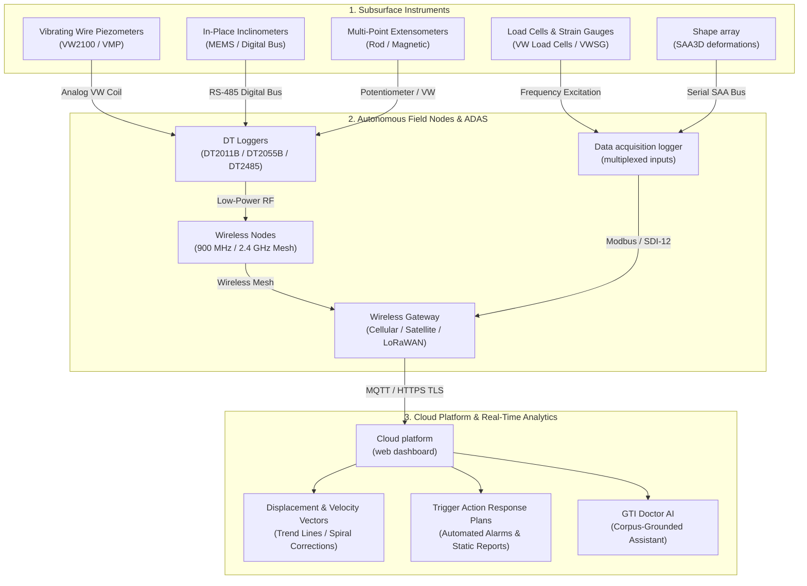

# 📊 Môi trường thử nghiệm tương tác

Trải nghiệm mô hình trực quan tương tác của các hệ thống thiết bị quan trắc địa kỹ thuật, vật lý cảm biến, cấu trúc mạng thu thập dữ liệu tự động, và biểu đồ chuyển vị thời gian thực.

---

  

    

      <h2 style="margin: 0; color: #ff6b35; font-size: 22px;">🛠️ Geotech Instrumentation Sandbox</h2>
      
Select an engineering scenario to simulate field instrumentation and data profiles

    

    

      <button id="btn-dam" onclick="switchScenario('dam')" style="background: #ff6b35; color: white; border: none; padding: 8px 16px; border-radius: 6px; cursor: pointer; font-weight: 600;">Earth Dam Seepage</button>
      <button id="btn-excavation" onclick="switchScenario('excavation')" style="background: #2a2a35; color: #ccc; border: none; padding: 8px 16px; border-radius: 6px; cursor: pointer; font-weight: 600;">Deep Excavation</button>
      <button id="btn-slope" onclick="switchScenario('slope')" style="background: #2a2a35; color: #ccc; border: none; padding: 8px 16px; border-radius: 6px; cursor: pointer; font-weight: 600;">Slope Inclinometer</button>
    

  

  <!-- Interactive Canvas and SVG Viewport -->
  

    <!-- Graphical Cross Section -->
    

      

        Cross-Section & Sensor Array
        Earth Embankment Dam (Dunnicliff Ch. 21)
      

      <svg id="geo-svg" viewBox="0 0 600 340" style="width: 100%; height: 320px; background: #0d0d11; border-radius: 6px;">
        <!-- Dynamically rendered via JS -->
      </svg>
      

        
 Piezometer (VWP)

        
 Inclinometer (IPI/MEMS)

        
 Extensometer / Settlement

        
 Wireless Node

      

    

    <!-- Live Telemetry & Control Panel -->
    

      

        <h4 style="margin: 0 0 12px 0; color: #f0f0f5; font-size: 15px; border-bottom: 1px solid #2a2a35; padding-bottom: 6px;">Live ADAS Diagnostics</h4>
        
        

          <label style="font-size: 12px; color: #aaa; display: flex; justify-content: space-between;">
            Simulated Hydrostatic Head:
            <strong id="val-head" style="color: #00e5ff;">18.5 m</strong>
          </label>
          <input type="range" id="slider-head" min="5" max="30" value="18.5" step="0.5" oninput="updateSimulation()" style="width: 100%; margin-top: 4px; accent-color: #00e5ff;">
        

        

          <label style="font-size: 12px; color: #aaa; display: flex; justify-content: space-between;">
            Ground Displacement Velocity:
            <strong id="val-disp" style="color: #ff4081;">1.2 mm/day</strong>
          </label>
          <input type="range" id="slider-disp" min="0" max="10" value="1.2" step="0.1" oninput="updateSimulation()" style="width: 100%; margin-top: 4px; accent-color: #ff4081;">
        

        

          
TARP Trigger State

          
NORMAL (Level 0)

        

        

          
📡 <strong>Telemetry:</strong> LoRaWAN 915 MHz

          
🔋 <strong>Hub Battery:</strong> 3.65V (SAFT LSH20)

          
📶 <strong>RSSI:</strong> -42 dBm (Excellent)

          
⏱️ <strong>Interval:</strong> 15 mins (Continuous)

        

      

      

        P_vw1: 181.4 kPa 
        T_vw1: 14.2 °C 
        Incli_max: 3.4 mm @ -12m
      

    

  

---

## 🏗️ Kiến trúc viễn đo ADAS từ đầu đến cuối

Sơ đồ dưới đây minh họa cách các cảm biến hiện trường kết nối vào kiến trúc trí tuệ đám mây không dây:

