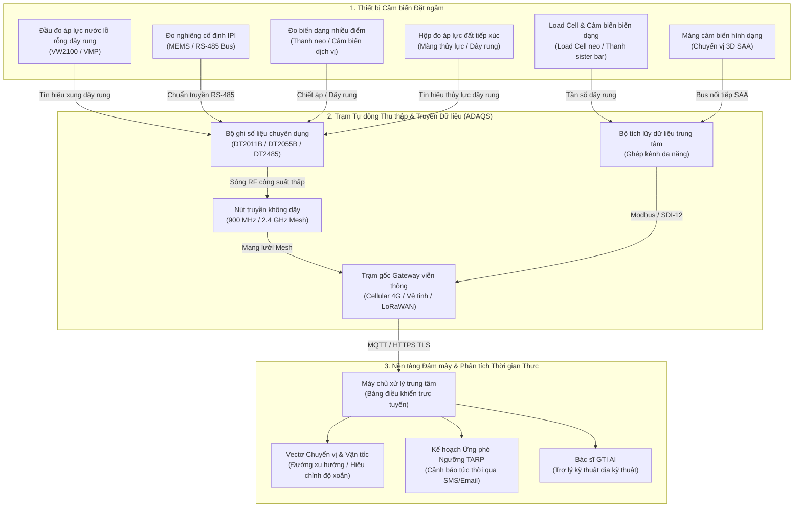

# 📊 Môi trường thử nghiệm tương tác

Trải nghiệm mô hình trực quan tương tác của các hệ thống thiết bị quan trắc địa kỹ thuật, vật lý cảm biến, cấu trúc mạng thu thập dữ liệu tự động, và biểu đồ chuyển vị thời gian thực.

---

  

    

      <h2 style="margin: 0; color: #ff6b35; font-size: 22px;">🛠️ Môi trường Mô phỏng Địa kỹ thuật Tương tác</h2>
      
Chọn kịch bản công trình kỹ thuật để mô phỏng bố trí thiết bị quan trắc hiện trường và số liệu đo đạc

    

    

      <button id="btn-dam" onclick="switchScenario('dam')" style="background: #ff6b35; color: white; border: none; padding: 7px 13px; border-radius: 6px; cursor: pointer; font-weight: 600; font-size: 12px;">Đập đất</button>
      <button id="btn-excavation" onclick="switchScenario('excavation')" style="background: #2a2a35; color: #ccc; border: none; padding: 7px 13px; border-radius: 6px; cursor: pointer; font-weight: 600; font-size: 12px;">Hố đào sâu</button>
      <button id="btn-slope" onclick="switchScenario('slope')" style="background: #2a2a35; color: #ccc; border: none; padding: 7px 13px; border-radius: 6px; cursor: pointer; font-weight: 600; font-size: 12px;">Mái dốc</button>
      <button id="btn-tunnel" onclick="switchScenario('tunnel')" style="background: #2a2a35; color: #ccc; border: none; padding: 7px 13px; border-radius: 6px; cursor: pointer; font-weight: 600; font-size: 12px;">Hội tụ hầm</button>
      <button id="btn-pile" onclick="switchScenario('pile')" style="background: #2a2a35; color: #ccc; border: none; padding: 7px 13px; border-radius: 6px; cursor: pointer; font-weight: 600; font-size: 12px;">Thử tải cọc</button>
      <button id="btn-retaining" onclick="switchScenario('retaining')" style="background: #2a2a35; color: #ccc; border: none; padding: 7px 13px; border-radius: 6px; cursor: pointer; font-weight: 600; font-size: 12px;">Tường chắn neo</button>
    

  

  <!-- Interactive Canvas and SVG Viewport -->
  

    <!-- Graphical Cross Section -->
    

      

        Mặt cắt Công trình & Cụm Cảm biến
        Đập đất đắp (Dunnicliff Ch. 21)
      

      <svg id="geo-svg" viewBox="0 0 600 340" style="width: 100%; height: 320px; background: #0d0d11; border-radius: 6px;">
        <!-- Render động qua JS -->
      </svg>
      

        
 Piezometer (VWP)

        
 Inclinometer (IPI/MEMS)

        
 Extensometer / Đo lún

        
 Load Cell / Biến dạng

        
 Áp lực đất (EPC)

        
 Trạm gốc không dây

      

    

    <!-- Live Telemetry & Control Panel -->
    

      

        <h4 style="margin: 0 0 12px 0; color: #f0f0f5; font-size: 15px; border-bottom: 1px solid #2a2a35; padding-bottom: 6px;">Thông số Đo đạc Tự động ADAS</h4>
        
        

          <label style="font-size: 12px; color: #aaa; display: flex; justify-content: space-between;">
            Cột nước Thủy tĩnh:
            <strong id="val-head" style="color: #00e5ff;">18.5 m</strong>
          </label>
          <input type="range" id="slider-head" min="5" max="30" value="18.5" step="0.5" oninput="updateSimulation()" style="width: 100%; margin-top: 4px; accent-color: #00e5ff;">
        

        

          <label style="font-size: 12px; color: #aaa; display: flex; justify-content: space-between;">
            Tốc độ Chuyển vị / Ứng suất:
            <strong id="val-disp" style="color: #ff4081;">1.2 mm/ngày</strong>
          </label>
          <input type="range" id="slider-disp" min="0" max="10" value="1.2" step="0.1" oninput="updateSimulation()" style="width: 100%; margin-top: 4px; accent-color: #ff4081;">
        

        

          
Cấp độ Cảnh báo TARP

          
BÌNH THƯỜNG (Cấp 0)

        

        

          
📡 <strong>Viễn thông:</strong> LoRaWAN 915 MHz / Mesh

          
🔋 <strong>Pin trạm gốc:</strong> 3.65V (SAFT LSH20)

          
📶 <strong>Cường độ RSSI:</strong> -44 dBm (Rất tốt)

          
⏱️ <strong>Chu kỳ đo:</strong> 15 phút (Liên tục)

        

      

      

        P_vw1: 181.4 kPa 
        T_vw1: 14.2 °C 
        Incli_max: 3.4 mm @ -12m
      

    

  

---

## 🏗️ Kiến trúc Truyền thông Tự động ADAQS Từ Đầu Đến Cuối

Sơ đồ dưới đây minh họa luồng thu thập dữ liệu từ cảm biến hiện trường đến hệ thống phân tích đám mây thông minh:

